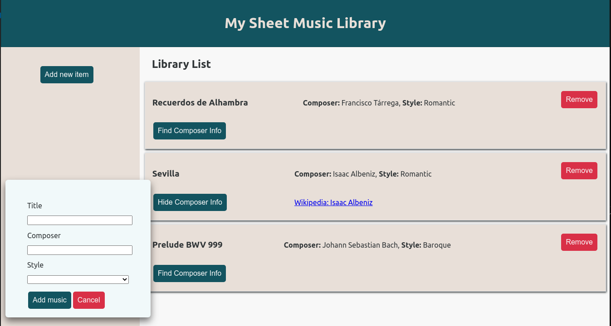
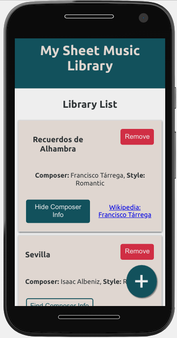

# Sheet Music Library App

This is a web application that allows you to create a reference for a Sheet Music Library. It is based on a activity from the [Odin Project Javascript course](https://www.theodinproject.com/courses/javascript/lessons/library), in which you may apply Object Constructors, Prototype inheritance and Factory Functions pattern.

After the first version made in pure Javascript (check on my [CodePen](https://codepen.io/le-santos/pen/MWKrZWZ)) I created a new version using React.

Check here: https://sheet-music-library-react.vercel.app/ 

 


## How to Install?
 
Download or clone this repository.

Make sure you have installed node version >= 10. You may check with: `node -v`

In the project directory, install the necessary packages locally by running: 

```
npm install
```

Next, start up a local server: 
```
npm start
```

Your app will be running at http://localhost:3000.

## How it works?

1. Click **Add new item** to the create a new entry and to reveal the input form.
2. Fill the form with *Title*, *Composer* and select the *Style* from the list. 
3. Then, click **Add Music** to create a new item on the list, or **Cancel** the operation.
4. The button **Find Composer Info** searches for the composer's name in Wikipedia and returns a Link to the page.
5. Click **Hide Composer Info** to hide the link.
5. The button **Remove** deletes the entry from the list.

There is a responsive version also, where the **Add new item button** is replaced with a **+** button.

## Built with:
+ [React 16.13.1](https://github.com/facebook/react/) -> [Create React App 3.4.1](https://github.com/facebook/create-react-app)
+ [Styled Components 5.1.1](https://styled-components.com/)
+ [Eslint](https://eslint.org/docs/user-guide/getting-started)
+ [Prettier](https://github.com/prettier/prettier) 
+ [Open Search API](https://www.mediawiki.org/wiki/API:Opensearch)


